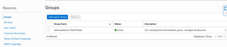
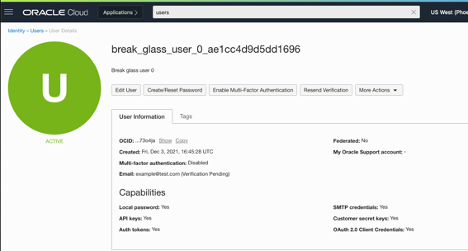

# Landing Zone Implementation Guide

## Prerequisites
---
When launching the Baseline Landing Zone, you’ll need to have certain values ready to successfully launch the stack. Here are the most important values to consider before launching:
* We automatically tag every resource created using the CostCenter and GeoLocation values that you’ll provide.
* The parent compartment name, which is the top level organizational compartment.
* Workload compartment names, for one or more workloads.
* Email addresses for Break Glass users, which are to be used for emergency use only
* CIDR Block for the allow list on the Bastion

Lastly, CIDR blocks will need to be defined for the following subnets created within the VCN:
* Public
* Private – one for each workload
* Database – one for each workload
* Shared
* Bastion

## How to Deploy
---
The Baseline Landing Zone can be launched through Oracle Resource Manager or from the Terraform CLI.

## Terraform Modules
---
The Baseline Landing Zone is comprised of multiple Terraform modules. While each module was written to work together in a stack, knowing the contents of each module may help you understand how to scale and operate the stack further. At the top-level directory, each module has a module-variables.tf, a module.tf file, and a sub-directory named after the module. For example: compartments-variables.tf, compartments.tf, and compartments (directory).

### Compartments
The compartments module contains sub-modules for building out the Baseline Landing Zone compartment structure. This includes the parent level compartment, security, network, and workload-specific compartments.

### Budget
The budget module is optional in the Baseline Landing Zone and will build a compartment-level budget alarm based on a threshold defined by the user. The budget defined will be valid for everything that resides under the parent compartment.

### VCN
The VCN module builds and configures all network related resources, including a VCN, subnets, gateways, security lists, and routing rules. This module also configures optional Dynamic Routing Gateways, using either IPSec or FastConnect. 

### IAM
The IAM module creates nearly all required policies and groups. There is also a sub-module that creates a break-glass user (in case of emergencies).

In some cases, an IAM policy may be created in a separate module, if the functionality is related to a specific feature (For example, if Cloud Guard is being used, the related policies are created within the Cloud Guard sub-module).

### Security
The security module implements VCN flow-logs, Cloud Guard, audit logging, and the OCI Bastion service.

### Tags
The OCI Baseline Landing Zone includes a set of freeform tags that are applied to resources created within the template.  Each resource created is given a default assigned value for the Description tag. The input values defined at creation of the stack will propagate to the CostCenter and GeoLocation tag values.

## IAM Policies and Groups
---
Oracle Cloud Infrastructure IAM lets you control who has access to specific cloud resources and what type of access a group of users can have. The Baseline Landing Zone provisions IAM groups with established roles and access levels. Each IAM group is referenced in IAM policies to grant access to the associated resources. All groups belong to the tenancy compartment and every policy belongs to the compartment closest to the resource it controls access to.

To add users to the other created groups:
1.  Verify that the groups and policies are provisioned by visiting Identity/Groups in the console
2.	Select one of the created groups you want to add a user to.  Click Add User to Group button and choose the user to add in the dropdown.

Alternatively, user membership to groups can be managed through the API or terraform.

The Landing Zone stack provisions the following groups and policies. The group names listed are the default names but can be overridden by updating the Terraform variables upon stack creation. 

You may have a need to rename groups to fit your organizational structure or to map with a federated service.

<table>
  <thead>
    <tr>
      <th>Policy Name </th>
      <th>OCI-LZ-[OCI-Region-Key]-VCNAdminPolicy </th>
    </tr>
  </thead>
  <tbody>
    <tr>
      <td> Access Details </td>
      <td> Manage All Network Resources </td>
    </tr>
    <tr>
      <td> Access Level </td>
      <td> Compartment – Network </td>
    </tr>
    <tr>
      <td> Access Description </td>
      <td> 
        Network Administrators with rights to manage all network resources in the Network Compartment. 
        The user can also create and modify load balancers in each of
        these workload compartments
      </td>
    </tr>
  </tbody>
</table>

<table>
  <thead>
    <tr>
      <th> Policy Name </th>
      <th> OCI-LZ-[WorkloadName]-WorkloadAdminPolicy </th>
    </tr>
  </thead>
  <tbody>
    <tr>
      <td>Access Details</td>
      <td>
        Ability to do everything with custom images and compute instances.
         Ability to do everything with
        Instance Configurations, Instance Pools, and Cluster Network
         Ability to create, update and delete
        autoscaling configurations.
         Ability to create and list subscriptions to images in the partner Image
        catalog.
         Ability to manage Instance Console Creation.
         Ability to create, Update and delete dedicated Virtual Machine Hosts.
      </td>
    </tr>
    <tr>
      <td>Access Level</td>
      <td> Compartment – Workload (Respective)</td>
    </tr>
    <tr>
      <td>Access Description</td>
      <td>
        Compute Administrators will be able to manage all resources required for management of the
        workloads. This includes the ability to manage all things related to launching instances on the network
        VCNs, using any of the autoscaling clusters or instance pools, and images in the catalog.
      </td>
    </tr>
  </tbody>
</table>

<table>
  <thead>
    <tr>
      <th>Policy Name </th>
      <th>OCI-LZ-[ WorkloadName]-WorkloadUserPolicy </th>
    </tr>
  </thead>
  <tbody>
    <tr>
      <td> Access Details </td>
      <td>
        Ability to do everything with instances launched into the cloud
        network and subnets in compartment.
         Ability to launch instances into the
        cloud network and subnets in compartment.
         Ability to list and create subscriptions to images in partner image catalog.
         Ability to create instance console creation.
         Ability to launch instances on dedicated virtual
        machine hosts.
      </td>
    </tr>
    <tr>
      <td> Access Level </td>
      <td> Compartment – Workload (Respective) </td>
    </tr>
    <tr>
      <td> Access Description </td>
      <td>
        Compute Users will be able to use all compute resources for the workloads. Unlike the workload admin,
        this user can only launch instances and dedicated VMs, not clusters, pools, or instance images.
        Similarly, it can create console connections and view images in the partner image catalog.
      </td>
    </tr>
  </tbody>
</table>

<table>
  <thead>
    <tr>
      <th>Policy Name </th>
      <th>OCI-LZ-[WorkloadName]-StorageAdminPolicy </th>
    </tr>
  </thead>
  <tbody>
    <tr>
      <td> Access details </td>
      <td>
        Ability to do all things with block storage volumes, volume
        backups, and volume groups in all compartments
         Ability to do all things with volume backups
         Ability to do all things with boot volume backups
         Ability to create a volume group from a set of volumes.
         Ability to clone a volume group from an existing volume group.
         Ability to create Volume Group backup.
         Ability to create volume groups by restoring volume group backups.
         Ability to create, manage and delete filesystems.
         Ability to do all things with Object Storage Buckets and objects.
      </td>
    </tr>
    <tr>
      <td> Access Level </td>
      <td> Compartment – Workload (Respective) </td>
    </tr>
    <tr>
      <td> Access Description </td>
      <td>
        Storage Admins can manage all types of storage requirements for the workload.
        This includes managing both buckets and objects, and block storage volumes and backups.
      </td>
    </tr>
  </tbody>
</table>

<table>
  <thead>
    <tr>
      <th>Policy Name </th>
      <th>OCI-LZ-[WorkloadName]-StorageUserPolicy </th>
    </tr>
  </thead>
  <tbody>
    <tr>
      <td> Access Details </td>
      <td>
        Ability to write objects to any Object Storage bucket in compartment.
         Ability to download objects from and Object Storage bucket in compartment.
      </td>
    </tr>
    <tr>
      <td> Access Level </td>
      <td> Compartment – Workload (Respective) </td>
    </tr>
    <tr>
      <td> Access Description </td>
      <td>
        Storage Users can write and read from the object storage in the
        compartment.
      </td>
    </tr>
  </tbody>
</table>

<table>
  <thead>
    <tr>
      <th>Policy Name </th>
      <th>OCI-LZ-[OCI-Region-Key]-SecurityAdmins </th>
    </tr>
  </thead>
  <tbody>
    <tr>
      <td> Access Details </td>
      <td>
        Ability to associate an Object Storage bucket, Block Volume volume,
        File Storage file system, Kubernetes cluster, or Streaming stream pool
        with a specific key authorized for use in a specific compartment.
         Ability to list, view, and perform cryptographic operations with all
        keys in compartment
         Ability to do all things with secrets in a specific vault in compartment.
         Ability to Manage all resources in Bastion Services in all compartments
         For Baseline and Vault – Important note. –
      </td>
    </tr>
    <tr>
      <td> Access Level </td>
      <td> Compartment – Security </td>
    </tr>
    <tr>
      <td> Access Description </td>
      <td>
        The security admin has scope of only the security compartment.
        This user can manage and use encryption keys to encrypt resources.
        The user can also view the vault service which manages user keys and secrets.
        Finally, the user manages the bastion resources which allow the user to
        connect to hosts and subnets in the VCN.
      </td>
    </tr>
  </tbody>
</table>

## Cloud Guard Strategy
---
Cloud Guard is an OCI resource that detects misconfigured resources and insecure activity across tenants. It enables security administrators to triage and resolve cloud security issues. Security inconsistencies can be automatically resolved with out-of-the-box security recipes.

### Disable/Enable Cloud Guard
In the baseline landing zone stack set variable cloud_guard_configuration_status to “ENABLE” to enable Cloud Guard in Tenancy level and set to “DISABLE” to disable the service.

### Steps to Clone Recipes
Only a member of the CloudGuardArchitect group can clone recipes. 
To clone a recipe:
1.	Navigate to Cloud Guard service page on Console.
2.	From the Cloud Guard options panel on the left, select Detector Recipes.
3.	Click Clone, then in the Clone Detector Recipe dialog box, select the detector recipe you want to clone, and enter the Name, Description, Compartment Assignment.
4.	Click Clone

### Usage and Best Practices
In the baseline landing zone stack, the following Cloud Guard resources are provisioned. Users may need to be added to specific IAM groups in order to access and manage Cloud Guard resources.

Cloud Guard is a powerful tool that can ensure your tenancy is security-hardened and for maintaining secure configuration for your resources. You can define a target resource you want Cloud Guard to monitor and utilize either Oracle-managed or user-managed detector recipes. In our landing zones stack, our target is all resources within the parent compartment. The target defines the scope of what Cloud Guard is to check.

The reporting region for Cloud Guard is set to the tenancy’s home region by default. This is because if Cloud Guard is already enabled in the tenancy, then it would need to be disabled and then enabled again if the reporting region is not the home region, which adds unnecessary complexity. Cloud Guard can detect events in the region where the landing zone is deployed, even if the reporting region is different. If necessary, the reporting region can be changed manually. More details on that can be found here. 

We utilize two Oracle-managed recipes, OCI Configuration Detector Recipe and OCI Activity Detector Recipe. These detector recipes will perform checks and identify potential security problems on your resources.

You have the option of creating your own responder recipes and rules, which are actions that Cloud Guard can take when a detector has encountered a problem. The available actions are resource specific. Responders are structured in a similar way to detectors.

### Policies
The following additional IAM policies are provisioned with Cloud Guard.

#### OCI-LZ-Cloud-Guard-Policy
These policies configure permissions for Cloud Guard to access tenancy resources:
* Read-only access to tenancy keys
* Read-only access to compartments
* Read-only access to compute management family
* Read-only access to virtual network family
* Read-only access to volume family
* Read-only access to audit events
* Read-only access to vaults
* Read-only access to object family
* Read-only access to load balancers
* Read-only access to groups
* Read-only access to dynamic groups
* Read-only access to users
* Read-only access to database family
* Read-only access to authentication policies
* Read-only access to policies

#### OCI-LZ-Scanning-Service-Policy
These policies configure permissions for the Cloud Guard vulnerability scanning service to access resources in the parent compartment:
* Manage access to instances
* Read-only access to compartments
* Read-only access to VNICs
* Read-only access to VNIC-attachments

#### Cloud Guard Target
OCI-LZ-Cloud-Guard-Target

In the baseline landing zone stack, a user-managed Cloud Guard target is deployed. The target resource id is the parent compartment and all resources within it. It uses two Oracle-managed detector recipes.

#### Vulnerability Scanning Service Host Scan Recipe
OCI-LZ-Scanning-Service-Recipe

In the baseline landing zone stack, a user-managed Vulnerability Scanning service host scan recipe is deployed into the security compartment. The agent is configured in Terraform, as well as the port scanning level and scan schedule.

#### Vulnerability Scanning Service Host Scan Target
OCI-LZ-Scanning-Service-Target

In the baseline landing zone stack, a user-managed Vulnerability Scanning service host scan target is deployed into the security compartment. This resource uses the Vulnerability Scanning service host scan recipe created by the stack. The target resource id is the parent compartment and all resources within it. 

## Break Glass User
---
The Break Glass User is an IAM group for emergency access to all OCI services in the tenancy. The users in this group must be using multi factor authentication.

### Resources
* The IAM username for the break glass user by default is break_glass_user_#.
* The IAM group name for the break glass user by default is Administrators.
* The IAM policy for this user by default is named OCI-LZ-Admin-TenantAdminPolicy. The policy contains one statement: Allow group <administrator group name> to manage all-resources in tenancy where request.user.mfaTotpVerified='true'.

### Usage
1. The Landing Zone stack can provision users in this IAM group using the break_glass_user_email_list variable. Multiple Break Glass Users can be created by passing valid emails to this list variable.
2. Once the users have been provisioned, a password reset email will be sent to grant access to the account
3. Once logged in to the account, users in this group can view their membership in the Identity/Users/User Details section of the console.

4. To manage the tenancy, the user must enable multi factor authentication in the Identity/Users/User Details of the console. After pressing the Enable Multi-Factor Authentication button, a QR code will be created which can be scanned by an Authenticator App.

5. Once the MFA authentication is enabled for the account, it can be used to manage the tenancies through API or console.

## Bastion
---
The bastion provides restricted and time-limited access to cloud resources without public-facing endpoints. There are two types of bastion sessions, managed SSH and port forwarding, which depends on the type of target resource.
* Managed SSH sessions simplify SSH access to native Oracle Linux images running Oracle Cloud Agent.
* Port forwarding creates a secure connection between a specific port on the client machine and a specific port on the target resource.

### Resources
The Landing Zone stack creates a bastion named, LZBastion and a subnet, OCI-LZ-Bastion-{region_key}-subnet. The stack does not provision bastion sessions, these need to be created outside the Landing Zone stack. The subnet and bastion are attached to the default VCN residing in the network compartment.

### Usage
To deploy or update the stack via Oracle Resource Manager, fill in the required values.

| Field                                | Variable                             | Name                                                                         | Description |
| ------------------------------------ | ------------------------------------ | ---------------------------------------------------------------------------- | ----------- |
| Bastion Subnet CIDR Block            | bastion_subnet_cidr_block            | CIDR Block for bastion subnet                                                |
| Bastion Client CIDR Block Allow List | bastion_client_cidr_block_allow_list | A list of address ranges in CIDR notation that bastion is allowed to connect |

Once the bastion has been provisioned, sessions can be created via API or in the console at Security/Bastion.

For more on the bastion service, read the official documentation:
* https://www.oracle.com/security/cloud-security/bastion/
* https://docs.oracle.com/en-us/iaas/Content/Bastion/home.htm

## Budgets
---
The Baseline Landing Zone includes an optional Budget module. To enable this feature, select the option for “Budget Alerting” when deploying or updating the stack via Oracle Resource Manager, and fill in the required values.

| Field                       | Variable                     | Name                                   | Description |
| --------------------------- | ---------------------------- | -------------------------------------- | ----------- |
| Budget Amount               | budget_amount                | Monthly budget                         |
| Budget Alert Rule Threshold | budget_alert_rule_threshold  | Alerting threshold for spend           |
| Budget Alert Rule Recipient | budget_alert_rule_recipients | Email address to receive budget alerts |

The budget that is created applies to the parent compartment, which is provisioned during the initial run of the Baseline Landing Zone. For more on OCI budgets, please refer to the documentation:
* https://docs.oracle.com/en-us/iaas/Content/Billing/Concepts/budgetsoverview.htm

## Global Resources Control
---

The Enterprise Scale Baseline Landing Zone includes a global resources control through a variable flag deploy_global_resources. The default is set to true to deploy all resources. If need to extend the Landing Zone to another region, please set it to false to avoid resource conflict at the tenancy level.

### Global resources include:
* Cloud Guard service and related policies
* Audit Logging and related policies
* VCN Flow Log and related policies
* Groups and corresponding policies
    * Network Admin
    * Security Admin
    * Load Balancer User
    * Workload Admin
    * Workload User
    * Workload Storage Admin
    * Workload Storage User
    * Cloud Guard Operator
    * Cloud Guard Analyst 
    * Cloud Guard Architect

