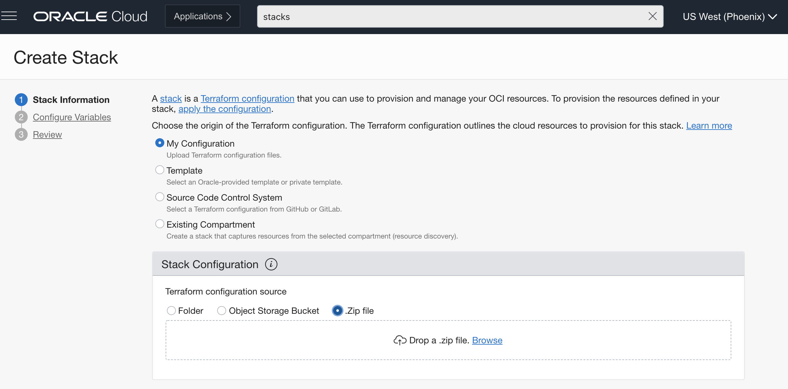
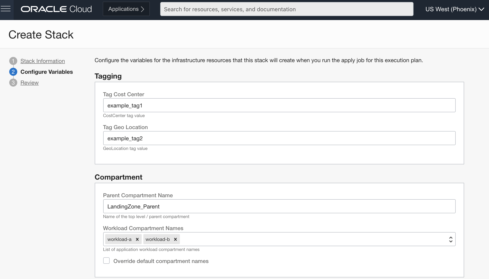

# oci-rsa-baseline-landing-zone
This Terraform stack deploys a baseline landing zone.

## Requirements
- [Terraform](https://www.terraform.io/) >= 1.0.6

## Prerequisites
Detailed project prerequisites are included in the following [Architecture Documentation](PLACEHOLDER)

## Usage

An example [tfvars file](examples/terraform.tfvars.example) is included for reference. This file is arranged according to 
category a particular variable belongs to. Not all the variables in this file are required.

### Steps to run in Resource Manager:

1. Download the zip of the source code from the [release](PLACEHOLDER) or clone the repository
   ```
   git clone ADD_URL_HERE
   ```
   Use the following command to zip the source code 
   
    ```
    zip -r oci-rsa-baseline-landing-zone.zip oci-rsa-baseline-landing-zone/ -x "*.git/*" "*.terraform*"
    ```


2. Select the region to want to deploy the baseline landing zone to before you create the stack.
3. From the OCI console, Navigate to > Resource Manager > Stacks and then create a stack.
4. In the Create Stack wizard, upload the zip file from step 1.
   
5. For the next step just enter the variables or override the default values for the existing variables. The example 
   [tfvars file](examples/terraform.tfvars.example) can be used for reference.
   
   
6. Finally, create the stack and apply to run it.


### Steps to run the stack from CLI:
Note: An example [tfvars file](examples/terraform.tfvars.example) is included for reference. Using this file is the 
preferred way to run the stack from the CLI, because of the large number of variables to manage.

To use this file just copy the example [tfvars file](examples/terraform.tfvars.example) and save it in the outermost directory.
Next, rename the file to **terraform.tfvars**. You can ovverride the example values set in this file.

#### Running Terraform
After specifying the required variables you can run the stack using
```
terraform init
terraform plan
terraform apply
```

### Terraform Variables
A complete listing of the Terraform variables used in this stack are referenced [here](VARIABLES.md). This document is automatically generated 
using the [terraform-docs](https://github.com/terraform-docs/terraform-docs) with the following command:

```
terraform-docs markdown table --sort-by required --show inputs --show outputs . > VARIABLES.md
```


## The Team
This repository was developed by the Oracle OCI Regulatory Solutions and Automation (RSA) team. 

## How to Contribute
Interested in contributing?  See our contribution [guidelines](CONTRIBUTE.md) for details.

## License
This repository and its contents are licensed under [UPL 1.0](https://opensource.org/licenses/UPL).